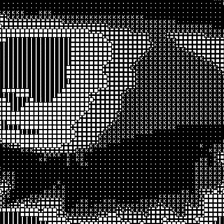
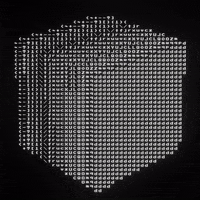
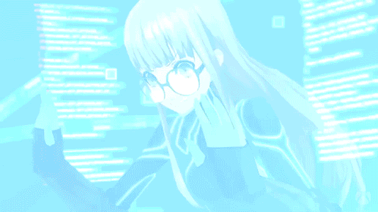

<div align="center">

</div>

<div align="center">

[](https://git.io/typing-svg)

</div>

---

<table width="100%"><tr>
<td width="35%" align="center"></td>
<td width="65%" valign="middle">

```
 ______________________________________________________
|  caffienated-nick                                    |
|  --------------------------------------------------- |
|  builds weird side projects nobody asked for.        |
|  goes deep on AI/ML. writes poetry AND code.         |
|                                                      |
|  into everything: beats. cars. films. machines.      |
|  games. art. whatever comes next.                    |
|                                                      |
|  caffeinated chaos. always building.                 |
|  indie cult film, not a blockbuster.                 |
|______________________________________________________|
```

  

</td>
</tr></table>

---

<div align="center">

<samp style="font-size: 50%;">


```
                      /$$$$$$   /$$$$$$  /$$                                 /$$                     /$$                   /$$           /$$       
                     /$$__  $$ /$$__  $$|__/                                | $$                    | $$                  |__/          | $$            
  /$$$$$$$  /$$$$$$ | $$  \__/| $$  \__/ /$$  /$$$$$$  /$$$$$$$   /$$$$$$  /$$$$$$    /$$$$$$   /$$$$$$$         /$$$$$$$  /$$  /$$$$$$$| $$   /$$ 
 /$$_____/ |____  $$| $$$$    | $$$$    | $$ /$$__  $$| $$__  $$ |____  $$|_  $$_/   /$$__  $$ /$$__  $$ /$$$$$$| $$__  $$| $$ /$$_____/| $$  /$$/ 
| $$        /$$$$$$$| $$_/    | $$_/    | $$| $$$$$$$$| $$  \ $$  /$$$$$$$  | $$    | $$$$$$$$| $$  | $$|______/| $$  \ $$| $$| $$      | $$$$$$/ 
| $$       /$$__  $$| $$      | $$      | $$| $$_____/| $$  | $$ /$$__  $$  | $$ /$$| $$_____/| $$  | $$        | $$  | $$| $$| $$      | $$_  $$ 
|  $$$$$$$|  $$$$$$$| $$      | $$      | $$|  $$$$$$$| $$  | $$|  $$$$$$$  |  $$$$/|  $$$$$$$|  $$$$$$$        | $$  | $$| $$|  $$$$$$$| $$ \  $$
 \_______/ \_______/|__/      |__/      |__/ \_______/|__/  |__/ \_______/   \___/   \_______/ \_______/        |__/  |__/|__/ \_______/|__/  \__/ 
                                                                                                                                                        
                                                                                                                                                        
                                                                                                                                                        
```

</samp>


</div>

---

<table width="100%"><tr>
<td width="65%" valign="middle">

```
  LOADOUT
  -------------------------------------------
```

       

```
  currently going deep on AI/ML.
  not the tutorial kind.
  the 40 browser tabs at 2am kind.
```

</td>
<td width="35%" align="center"></td>
</tr></table>

---

<div align="center">
&nbsp;&nbsp;
</div>

---

<div align="center">

```
  THE NUMBERS
```

 


</div>

---

<table width="100%"><tr>
<td width="35%" align="center"></td>
<td width="65%" valign="middle">

```
  not chasing trends.
  not following a roadmap.

  music on. headphones in.
  building something weird that
  probably won't go viral and
  i genuinely do not care.

  the best projects are the ones
  you build because you had to.
```

  

</td>
</tr></table>

---

<div align="center">

```
⣿⣿⣿⣿⣿⣿⣿⣿⣿⣿⣿⣿⣿⣿⣿⣿⣿⣿⣿⣿⣿⣿⣿⣿⣿⣿⣿⣿⣿⣿⣿⣿⣿⣿⣿⣿⣿⣿⣿⣿⣿⣿⣿⣿⣿⣿⣿⣿⣿⣿
⣿⣿⣿⣿⣿⣿⣿⣿⣿⣿⣿⣿⣿⣿⣿⣿⣿⣿⣿⣿⣿⣿⣿⣿⣿⣿⣿⣿⣿⣿⣿⣿⣿⣿⣿⣿⣿⣿⣿⣿⣿⣿⣿⣿⣿⣿⣿⣿⣿⣿
⣿⣿⣿⣿⣿⣿⣿⣿⣿⣿⣿⣿⣿⣿⣿⣿⣿⣿⣿⣿⣿⡿⢟⣭⣭⡥⠄⠤⠄⠉⠉⠙⠻⢿⣿⣿⣿⣿⣿⣿⣿⣿⣿⣿⣿⣿⣿⣿⣿⣿
⣿⣿⣿⣿⣿⣿⣿⣿⣿⢛⣛⢻⣿⣿⣿⣿⣿⣿⣿⣿⢋⡶⠋⣉⣥⠤⠀⣰⣄⠀⠀⠀⢠⠀⠻⣿⣿⣿⣿⣿⣿⣿⣿⣿⣿⣿⣿⣿⣿⣿
⣿⣿⣿⣿⣿⣿⣿⣿⡇⣸⡿⢿⢸⣿⣿⣿⣿⣿⣿⣱⡻⠿⠺⢭⣷⡤⠾⠛⠛⢷⣑⢄⣸⠀⠀⠘⣿⣿⣿⣿⣿⣿⣿⣿⣿⣿⣿⣿⣿⣿
⣿⣿⣿⣿⣿⣿⣿⣿⣧⣿⣶⣿⢸⣿⣿⣿⣿⣿⡇⢿⣀⣶⣿⣶⣵⣤⣠⣠⣤⣶⣿⣿⣿⣶⡄⠀⢸⣿⣿⣿⣿⣿⣿⣿⣿⣿⣿⣿⣿⣿
⣿⣿⣿⣿⣿⣿⣿⣿⣿⢻⣿⣿⣼⣿⣿⣿⣿⣿⡇⠦⢸⣿⣿⣿⣿⣿⣿⣿⣿⣿⣿⣿⣿⣿⡗⠀⢸⣿⣿⣿⣿⣿⣿⣿⣿⣿⣿⣿⣿⣿
⣿⣿⣿⣿⣿⣿⣿⣿⣿⢜⣛⣻⡇⣿⣿⣿⣿⣿⣷⠀⠀⣹⣿⣿⣿⣿⣿⣿⣿⣿⣿⣿⣿⣿⡟⠀⠈⢻⣿⣿⣿⣿⣿⣿⣿⣿⣿⣿⣿⣿
⣿⣿⣿⣿⣿⣿⣿⣿⣿⣼⣿⣿⡇⣿⣿⣿⣿⣿⡿⣀⠠⣿⣿⠿⠛⠛⠛⠿⣿⣿⠛⠋⠉⠀⠀⠀⠀⢸⣿⣿⣿⣿⣿⣿⣿⣿⣿⣿⣿⣿
⣿⣿⣿⣿⣿⣿⣿⢟⣭⡙⣿⣿⡇⣛⣛⢿⣿⣿⣧⠎⠶⣿⣷⣎⣁⣠⢄⣴⣿⣇⢠⣶⣶⣧⣤⡀⠀⢸⣿⣿⣿⣿⣿⣿⣿⣿⣿⣿⣿⣿
⣿⣿⣿⣿⣿⣿⣿⣾⣿⡇⣿⣿⣷⢹⣿⣇⢛⡻⢧⢠⣿⡿⣿⣿⣿⣿⣿⣿⣿⣿⠨⠻⣿⣿⣿⡇⠀⣾⣿⣿⣿⣿⣿⣿⣿⣿⣿⣿⣿⣿
⣿⣿⣿⣿⣿⣿⢣⢸⣿⣿⣿⣿⣿⣿⣿⣿⣶⣯⣌⢯⡻⠎⣌⢿⣿⡿⢋⣍⡛⠿⠛⠁⠹⣿⣿⡇⣸⣿⣿⣿⣿⣿⣿⣿⣿⣿⣿⣿⣿⣿
⣿⣿⣿⣿⡟⣱⣿⢈⣿⣿⣿⣿⣿⣿⣿⣿⣿⣿⡿⢸⣿⣿⠹⣿⣿⣇⠘⢛⣛⣒⣢⡤⠀⣼⡟⢀⣿⣿⣿⣿⣿⣿⣿⣿⣿⣿⣿⣿⣿⣿
⣿⣿⣿⣿⡰⣾⣿⢸⣿⣿⣿⢹⣿⣿⣿⡇⣿⣿⣧⢸⠿⠋⢰⡙⣿⣿⣿⣦⡀⠀⠀⢀⠂⣿⡇⣸⣿⣿⣿⣿⣿⣿⣿⣿⣿⣿⣿⣿⣿⣿
⣿⣿⣿⣿⣷⢻⣯⣼⣿⣿⣿⣇⣿⣿⣿⣇⣿⣿⣿⠀⠀⠀⠈⢿⣮⡻⣿⣿⣯⣍⣉⣥⣼⡿⢠⣷⣙⢿⣿⣿⣿⣿⣿⣿⣿⣿⣿⣿⣿⣿
⣿⣿⣿⣿⣿⡞⣿⣿⣿⣿⣿⣿⣿⣿⣿⣿⣿⣿⣿⠀⠀⠀⠀⠈⢻⣿⣦⣝⠿⠿⠿⠿⣛⣵⠛⠛⠿⣧⠙⠛⢿⣿⣿⣿⣿⣿⣿⣿⣿⣿
⣿⣿⣿⣿⣿⣷⣝⠿⣿⣿⣿⣿⣿⣿⣿⣿⣿⣿⡿⠀⠀⠀⠀⠀⠐⠜⢿⣿⣿⣿⡿⢂⣤⠌⠀⠀⢠⣀⣤⠀⠀⠈⠙⢿⣿⣿⣿⣿⣿⣿
⣿⣿⣿⣿⣿⣿⣿⣿⣎⢿⣿⣿⣿⣿⣿⣿⣿⣿⠁⠀⠀⠀⠀⠀⠀⠈⢆⠙⠿⠟⣠⣄⠐⠛⠓⠢⢸⣿⣿⣇⠀⠀⠀⠀⢿⣿⣿⣿⣿⣿
⣿⣿⣿⣿⣿⣿⣿⣿⣿⣷⣎⠩⣿⣿⣿⣿⡿⢋⣴⠀⠀⠀⠀⠀⠀⠀⠈⠳⣤⣾⣿⣿⣿⣮⡙⠒⠸⣿⣿⣿⡄⠀⠀⠀⠈⣿⣿⣿⣿⣿
⣿⣿⣿⣿⣿⣿⣿⣿⣿⣿⠟⠀⠿⢛⣫⣵⣾⠟⠁⠀⠀⠀⠀⠀⠀⠀⠀⠀⠹⣿⣿⣿⣿⣿⢀⠔⠋⣘⢿⣿⣇⠀⠀⠀⠀⣸⣿⣿⣿⣿
⣿⣿⣿⣿⣿⣿⣿⣿⡟⣣⣴⣶⠿⠟⠛⠉⠀⠀⠀⠀⠀⠀⠀⠀⠀⠀⠀⠀⠀⠹⣿⣿⣿⡿⠀⢠⡾⠋⠈⢿⣿⠀⣠⣴⣾⣿⣿⣿⣿⣿
⣿⣿⣿⣿⣿⣿⣿⣿⠈⠉⠁⠀⠀⠀⠀⠀⠀⠀⠀⠀⠀⠀⠀⠀⠀⠀⠀⢀⣀⣤⣷⣶⣶⣶⣶⣮⣤⣀⣀⣬⣵⣿⣿⣿⣿⣿⣿⣿⣿⣿
⣿⣿⣿⣿⣿⣿⣿⣿⡆⠀⠀⠀⠀⠀⠀⣠⣴⣶⣷⣦⣀⣀⣀⣀⣠⣴⣾⣿⣿⣿⣿⣿⣿⣿⣿⣿⣿⣿⣿⣿⣿⣿⣿⣿⣿⣿⣿⣿⣿⣿
⣿⣿⣿⣿⣿⣿⣿⣿⣿⣦⣀⣠⣤⣶⣿⣿⣿⣿⣿⣿⣿⣿⣿⣿⣿⣿⣿⣿⣿⣿⣿⣿⣿⣿⣿⣿⣿⣿⣿⣿⣿⣿⣿⣿⣿⣿⣿⣿⣿⣿
```

</div>

<div align="center">
&nbsp
</div>

<table width="100%"><tr>
<td width="65%" valign="middle">

```
  i write poetry too.
  not just code.

  both are about finding the exact
  word for something that doesn't
  have one yet.

  one compiles.
  one doesn't need to.
  everything is everything.
```

  

</td>
<td width="35%" align="center"></td>
</tr></table>

<div align="center">
&nbsp
</div>

<div align="center">
&nbsp;&nbsp;&nbsp;

---

<table width="100%"><tr>
<td width="35%" align="center"></td>
<td width="65%" valign="middle">

```
  FIELD DEPLOYMENTS
  -------------------------------------------
```

[](https://github.com/caffienated-nick/muxless)

[](https://github.com/caffienated-nick/Hotel-management-system)

[](https://github.com/zazriel/blackpearl)

</td>
</tr></table>

---

<table width="100%"><tr>
<td width="65%" valign="middle">

```
  late night. terminal open.
  model training in background.
  beats playing.

  the overlap between
  sound and signal.
  art and algorithm.

  the machine learns. so do i.
```

  

</td>
<td width="35%" align="center"></td>
</tr></table>

---

<div align="center">
⠀```⠀⠀⠀⠀⠀⠀⠀⠀⠀⠀⠀⠀⠀⠀⠀⠀⠀⠀⠀⠀⠀⠀⠀⠀⠀⠀⠀⠀⠀⠀⠀⠀⠀⠀⠀⠀⠀⠀⠀⠀⠀⠀⠀⠀⠀⠀⠀⠀⠀⠀⠀⠀⠀⠀⠀⠀⠀⠀⠀⠀⠀⠀⠀⠀⠀⠀
⠀⠀⠀⠀⠀⠀⠀⠀⠀⠀⠀⠀⠀⠀⠀⠀⠀⠀⠀⠀⠀⠀⠀⠀⠀⠀⠀⠀⠀⠀⠀⠀⠀⠀⠀⠀⠀⠀⠀⠀⠀⠀⠀⠀⠀⠀⢠⡆⠀⠀⠀⠀⠀⠀⠀⠀⠀⠀⠀⠀⠀⠀⠀⠀⠀⠀⠀
⠀⠀⠀⠀⠀⠀⠀⠀⠀⠀⠀⠀⠆⠀⠀⠀⠀⠀⠀⠀⠀⠀⣧⠀⠀⠀⠀⠀⠀⠀⠀⠀⠀⠀⠀⠀⠀⠀⠀⠀⠀⠀⠀⠀⠀⠀⢸⡃⠀⠀⠀⠀⠀⠀⠀⠀⠀⠀⡇⠀⠀⠀⠀⠀⠀⠀⠀
⠀⠀⠀⠀⠀⠀⠀⠀⠀⠀⠀⠀⠀⠀⠀⠀⠀⠀⠀⠀⠀⠀⣿⠀⠀⠀⠀⠀⠀⠀⠀⠀⠀⠀⠀⠀⠀⠀⠀⠀⠀⠀⠀⠀⠀⠀⣾⢇⠀⠀⠀⠀⠀⠀⠀⠀⠀⠀⡇⠀⠀⠀⠀⠀⠀⠀⠀
⠀⠀⠀⠀⠀⠀⠀⠀⠀⠀⠀⠀⠀⠀⠀⠀⠀⠀⠀⠀⠀⠀⠀⠀⠀⠀⠀⢀⠀⠀⠀⠀⠀⠀⠀⡄⠀⠀⠀⠀⠀⠀⡆⠀⠀⢀⡏⠘⡆⠀⠀⠀⠀⠀⠀⠀⠀⡼⡄⠀⠀⠀⠀⠀⠀⠀⠀
⠀⠀⠀⠀⠀⠀⠀⠀⠀⠀⠀⠀⠀⠀⠀⠀⠀⠀⠀⠀⠀⠀⠀⠀⠀⠀⠀⣾⠀⠀⠀⠀⠀⠀⢠⡧⠀⠀⠀⠀⢀⡰⠁⠀⠀⣾⠁⠀⢹⠀⠀⠀⠀⠀⠀⠀⢠⠃⡃⠀⠀⠀⠀⠀⠀⠀⠀
⠀⠀⠀⠀⠀⠀⠀⠀⠀⠀⠀⠀⠀⠀⠀⠀⠀⢦⡀⠀⠀⠀⠀⠀⠀⠀⢰⡇⠀⠀⠀⠀⠀⢠⣟⣇⠀⠀⠀⠀⢸⡇⠀⠀⠀⢃⠀⠀⢨⠇⠀⠀⠀⠀⠀⢀⡏⡌⠀⠀⠀⠀⠀⠀⠀⠀⠀
⠀⠀⠀⠀⠀⠀⠀⠀⠀⠀⠀⠀⠀⠀⠀⠀⠀⢸⡇⠀⠀⠀⠀⠀⠀⠀⢸⡇⠀⠀⠀⠀⠀⡾⡏⠙⣦⡀⠀⠀⣿⠃⠀⠀⠀⣬⡂⠀⣸⠀⠀⠀⠀⠀⠀⠘⠂⠀⠀⠀⠀⠀⠀⠀⠀⠀⠀
⠀⠀⠀⠀⠀⠀⠀⠀⠀⠀⠀⠀⠀⠀⠀⠀⠀⣾⢣⠀⠀⠀⠀⠀⠀⠀⢟⡇⠀⠀⠀⠀⢸⠃⠃⠀⠈⢷⠀⠀⣿⠀⠀⠀⠀⠙⣇⠖⠁⠀⠀⠀⠀⠀⠀⠀⠀⠀⠀⠀⠀⠀⠀⠀⠀⠀⠀
⠀⠀⠀⠀⠀⠀⠀⠀⠀⡞⠀⠀⠀⠀⠀⠀⠀⡇⠈⡇⠀⠀⠀⠀⠀⠀⠈⣇⠀⠀⠀⠀⠘⠀⠀⠀⠀⣸⠀⠀⢿⣦⡀⠀⠀⠀⠀⠀⠀⠀⠀⠀⠀⠀⠀⠀⠀⠀⠀⠀⠀⠀⠀⠀⠀⠀⠀
⠀⠀⠀⠀⠀⠀⠀⠀⠀⡿⠀⠀⠀⠀⠀⠀⠀⣷⠀⡇⠀⠀⠀⠀⠀⠀⠀⠙⣷⣤⡀⠀⠀⢠⣴⡀⢠⡏⠀⠀⠘⡏⠻⣆⠀⠀⠀⠀⠀⠀⠀⠀⢀⠀⠀⠀⠀⠀⠀⠀⠀⠀⠀⠀⠀⠀⠀
⠀⠀⠀⠀⠀⠀⠀⠀⠀⡇⠀⠀⠀⠀⠀⠀⠀⠈⠛⠀⠀⠀⠀⠀⣆⠀⠀⠀⢛⣷⠙⢧⡀⠀⠻⣯⠟⠀⠀⠀⠀⡷⠀⠘⣆⠀⠀⠀⢠⠀⠀⠀⢘⠀⠀⠀⠀⠀⠀⠀⠀⠀⠀⠀⠀⠀⠀
⠀⠀⠀⠀⠀⠀⠀⠀⠀⠧⠀⠀⠀⠀⠀⠀⠀⠀⠀⠀⠀⠀⠀⢸⣿⠀⠀⠀⠈⢾⡇⠈⣧⠀⠀⠀⠀⠀⠀⠀⣴⢇⠀⠀⢹⠀⠀⠀⢼⠀⠀⠀⡪⠀⠀⠀⠀⠀⠀⠀⠀⠀⠀⠀⠀⠀⠀
⠀⠀⠀⠀⠀⠀⠀⠀⠀⠀⠀⠀⠀⠀⠀⠀⠀⠀⠀⠀⠀⠀⠀⠀⠉⠀⠀⠀⠀⣾⠁⠀⣽⠀⠀⠀⠀⠀⣠⡼⠋⡜⠀⠀⣼⠀⠀⠀⡇⠀⠀⠀⡇⠀⠀⠀⠀⠀⠀⠀⠀⠀⠀⠀⠀⠀⠀
⠀⠀⠀⠀⠀⠀⠀⠀⠀⠀⠀⠀⢷⠀⠀⠀⠀⠀⠀⠀⠀⠀⡄⠀⠀⠀⠀⢀⣼⠃⠀⣰⠏⠀⠀⣠⣴⠞⠋⠀⡼⠁⠀⣰⠇⠀⠀⣸⠃⠀⠀⣸⡁⠀⠀⠀⠀⠀⠀⠀⠀⠀⠀⠀⠀⠀⠀
⠀⠀⠀⠀⠀⠀⠀⠀⠀⠀⠀⠀⠈⣇⠀⠀⠀⠈⡇⠀⠀⠀⡇⠀⠀⠀⢠⣾⠇⠀⣰⠋⠀⣠⢾⡟⠁⣠⡶⡓⠁⢀⣴⠋⠀⠀⢀⡏⠀⠀⣰⠿⡆⠀⠀⠀⠀⠀⠀⠀⠀⠀⠀⠀⠀⠀⠀
⠀⠀⠀⠀⠀⠀⠀⠀⠀⠀⠀⠀⠀⢻⡆⠀⠀⠀⠀⠀⠀⠀⡇⠀⠀⢠⡿⡃⠀⠀⢻⣄⢰⣯⠏⢠⢾⢪⠏⠀⣠⠞⠁⠀⠀⢐⣏⡀⠀⢠⡏⠀⢹⡄⠀⠀⠀⠀⠀⠀⠀⠀⠀⠀⠀⠀⠀
⠀⠀⠀⠀⠀⠀⠀⠀⠀⠀⠀⠀⠀⢸⡿⣆⠀⠀⠀⠀⠀⢸⠃⠀⠀⣿⡍⠀⠀⠀⠀⠉⠛⠀⢀⣯⠃⢸⠀⠀⡏⠀⠀⢀⡴⠛⡿⠀⠀⢸⠁⠀⠀⣷⠀⠀⠀⡀⠀⠀⠀⠀⠀⠀⠀⠀⠀
⠀⠀⠀⠀⠀⠀⠀⠀⠀⠀⠀⠀⠀⡬⠃⠸⡆⠀⠀⠀⠀⡸⢀⠀⠀⢿⡃⠀⢹⡒⢤⡀⠀⠀⠸⡇⠀⢸⡀⠀⢧⡀⠀⣾⠁⠀⣧⠀⠀⢪⡀⠀⠀⣿⠀⠀⢠⡃⠀⠀⠀⠀⡆⠀⠀⠀⠀
⠀⠀⠀⠀⠀⠀⠀⠀⠀⠀⠀⠀⢸⠖⠀⠀⣿⠀⠀⠀⣠⣗⡏⠀⠀⠘⣇⠀⠈⡇⠀⠙⢦⡀⢸⣧⠀⠀⢧⠀⠈⠳⣄⣿⠀⠀⢹⡄⠀⢸⡂⠀⠀⡿⠀⠀⡞⠀⠀⠀⠀⠘⠄⠀⠀⠀⠀
⠀⠀⠀⠀⠀⠀⠀⠀⠀⠀⢀⣮⠅⠀⠀⢠⡏⠀⠀⣼⡏⢸⡇⠀⠀⠀⢹⡆⢀⡇⠀⡄⠀⠱⣼⣺⡀⠀⡌⠳⡄⠀⠈⠙⠃⠀⠀⢻⡄⠈⣿⡄⣼⠃⠀⡰⠁⠀⠀⠀⠀⠀⠀⠀⠀⠀⠀
⠀⠀⠀⠀⠀⠀⠀⠀⠀⠀⢸⡟⠀⠀⣠⠟⠀⠀⠀⣿⠁⠈⣧⠀⠀⠀⢠⡇⢸⠁⢠⡇⠀⠀⢹⣇⠇⠀⢷⢦⠙⢦⠀⠀⣀⠀⠀⠀⢷⠀⠘⠟⠁⢀⣴⠃⠀⠀⠀⠀⠀⠀⠀⠀⠀⠀⠀
⠀⠀⠀⠀⠀⠀⠀⠀⠀⠀⠸⣇⠂⢰⡏⠀⠀⠀⠀⣿⢐⡆⠸⣆⢀⣰⠟⢀⡏⠀⣸⢳⠀⠀⠸⠏⠀⠀⣿⠃⡇⠈⢳⡀⡏⢧⠀⠀⢸⡆⠀⣠⣶⡟⠁⠀⠀⠀⠀⠀⠀⣸⠀⠀⠀⠀⠀
⠀⠀⠀⠀⠀⠀⠀⠀⠀⠀⠀⠙⢧⣘⣧⠀⠀⠀⢀⣿⠀⣇⠀⠹⠋⠁⠀⡜⢀⢮⠇⢸⠀⠀⠀⠀⢀⠞⠁⣰⠃⠀⠀⢳⠃⠈⡇⠀⢸⡇⣼⡳⢹⡁⠀⠀⠀⠀⠀⠀⠀⣧⠀⠀⠀⠀⠀
⠀⠀⠀⠀⠀⠀⠀⠀⠀⠀⠀⠀⠀⠉⠛⠆⠀⢀⡾⠁⣰⠟⡆⠀⠀⢀⠞⠀⢨⡏⢠⠏⠀⠀⠀⣴⠃⢀⡞⠁⠀⠀⠀⠀⠀⠀⡇⠀⣸⠁⣇⠇⢸⠀⠀⠀⠀⠀⠀⢀⡎⣸⠀⠀⠀⠀⠀
⠀⠀⠀⠀⠀⠀⠀⠀⠀⠀⠀⠀⠀⠀⠀⠀⢠⡞⠁⣰⡿⠀⠘⢆⡴⠋⠀⠀⠘⠓⠁⠀⠀⠀⢸⡇⠀⠘⣆⠀⠀⠀⠀⠀⠀⢰⠃⣰⠏⠀⣷⠀⠘⣇⠀⠀⠀⠀⠀⡇⠀⡇⠀⠀⠀⠀⠀
⠀⠀⠀⠀⠠⡄⠀⠀⠀⠀⠀⠀⠀⠀⠀⣴⠏⠁⡼⣛⡃⠀⠀⠀⠀⠀⠀⢀⡎⣿⠀⠀⠀⠀⠸⣧⠀⠀⠈⢦⡀⠀⠀⠀⠀⣸⢀⡟⠀⠀⢹⡄⡀⠹⡆⠀⠀⠀⠀⠀⠈⠁⠀⠀⠀⠀⠀
⠀⠀⠀⠀⠀⠁⠀⠀⠀⠀⣄⠀⠀⠀⣸⡻⠀⢸⣟⡊⠀⠀⠀⠀⠀⢀⡔⢕⠝⡹⠀⠈⢻⣖⠦⡽⣆⠀⠀⠀⠙⢦⠀⠀⠀⡏⠸⣇⣀⣀⣼⠃⡇⠀⠹⡄⠀⠀⠀⠀⠀⠀⠀⠀⠀⠀⠀
⠀⠀⠀⠀⠀⠀⠀⠀⠀⠀⢹⠀⠀⢠⣯⠇⠀⣗⠴⠁⠀⠀⠀⣀⢖⣥⠞⣡⠞⢁⡤⢖⢾⢻⠀⣸⠈⢳⡄⠀⠀⠀⠳⡄⠀⢧⠀⠈⠉⠉⢀⣠⣷⡀⠀⠹⡆⠀⠀⠀⠀⠀⠀⠀⠀⠀⠀
⠀⠀⠀⠀⠀⠀⠀⠀⠀⠀⠘⡇⠀⢸⡏⡇⠀⡿⡫⠀⠀⠀⢠⢣⠋⢉⠞⠁⡴⠁⠀⡼⢸⢈⣓⠃⠀⢀⡇⠀⠀⠀⠀⠹⡄⠀⡙⠒⠒⢒⡟⠉⠀⣇⠀⠀⣿⠀⠀⠀⠀⠀⠀⠀⠀⠀⠀
⠀⠀⠀⠀⠀⠀⠀⠀⠀⠀⠀⣷⡀⠈⣿⣣⠀⢧⢿⠀⠀⠀⣣⠇⠀⢸⠀⢠⠃⠀⠀⢧⢸⡁⠈⠉⠉⠱⡇⠀⠀⠀⠀⢀⠇⢰⣇⠀⠀⢸⠀⠀⠀⢸⠀⠀⣿⠀⠀⠀⠀⠀⠀⠀⠀⠀⠀
⠀⠀⠀⠀⠀⠀⠀⠀⠀⠀⠀⠘⣧⠀⠘⣷⣣⠘⢮⢧⠀⠀⣿⠀⠀⠈⢧⠀⣆⠀⠀⠈⠢⢵⣤⠀⠀⣜⠇⠀⠀⠀⢠⠞⠀⣏⠸⡄⠀⠃⠀⠀⠀⡞⠀⢠⡏⠀⠀⠀⠀⠀⠀⠀⠀⠀⠀
⠀⠀⠀⠀⠀⠀⠀⠀⠀⠀⠀⠀⠙⣽⣆⡈⠻⣵⡈⠻⣷⠀⠻⡄⠀⠀⠀⠑⠿⣆⠀⠀⠀⠀⠀⠀⡠⠏⠀⠀⢀⢔⣁⣀⡀⢸⡀⠹⡄⠀⠀⠀⢠⠇⢀⡾⠁⠀⠀⠀⠀⠀⠀⠀⠀⠀⠀
⠀⠀⠀⠀⠀⠀⠀⠀⠀⠀⠀⠀⠀⠈⣿⡝⠲⠶⠭⠷⢎⡵⠀⢝⣆⠀⠀⠀⠀⠘⢦⡀⠀⠀⠀⠴⠋⠀⠀⢰⡁⠀⢉⡇⠉⠞⠀⠀⣹⠀⠀⢀⡎⢀⡾⠃⠀⠀⠀⠀⠀⠀⠀⠀⠀⠀⠀
⠀⠀⠀⠀⠀⠀⠀⠀⠀⠀⠀⠀⠀⠀⠈⠻⣦⡰⡒⠚⠉⣄⠀⠀⠋⠳⢦⡀⠀⠀⠀⠙⠀⠀⠀⠀⠀⠀⠀⠀⠉⠚⠉⠀⠀⠀⠀⣠⠃⠀⢀⣞⡴⠋⠀⠀⠀⠀⠀⠀⠀⠀⠀⠀⠀⠀⠀
⠀⠀⠀⠀⠀⠀⠀⠀⠀⠀⠀⠀⠀⠀⠀⠀⠈⠻⣝⣦⡀⠹⡍⠒⠒⠚⠉⠀⠀⠀⠀⠀⠀⠀⠀⠀⠀⠀⠀⠀⠀⠀⠀⠀⠀⣠⠜⢁⣀⣴⠟⠉⠀⠀⠀⠀⠀⠀⠀⠀⠀⠀⠀⠀⠀⠀⠀
⠀⠀⠀⠀⠀⠀⠀⠀⠀⠀⠀⠀⠀⠀⠀⠀⠀⠀⠈⠙⠻⢦⣼⣦⡄⠀⠀⠀⠀⡀⠀⠀⠀⠀⠀⠀⠀⠀⠀⠀⠀⠀⠀⠀⠀⠀⠉⣡⡾⠃⠀⠀⠀⠀⠀⠀⠀⠀⠀⠀⠀⠀⠀⠀⠀⠀⠀
⠀⠀⠀⠀⠀⠀⠀⠀⠀⠀⠀⠀⠀⠀⠀⠀⠀⠀⠀⠀⠀⠀⠀⠀⠙⠓⠒⠒⠛⠻⢤⠀⠀⠀⠀⠀⠀⠀⠀⣀⣤⠞⠛⠓⠒⠚⠋⠁⠀⠀⠀⠀⠀⠀⠀⠀⠀⠀⠀⠀⠀⠀⠀⠀⠀⠀⠀
⠀⠀⠀⠀⠀⠀⠀⠀⠀⠀⠀⠀⠀⠀⠀⠀⠀⠀⠀⠀⠀⠀⠀⠀⠀⠀⠀⠀⠀⠀⠀⠁⠁⠀⠀⠂⠐⠀⠈⠉⠀⠀⠀⠀⠀⠀⠀⠀⠀⠀⠀⠀⠀⠀⠀⠀⠀⠀⠀⠀⠀⠀⠀⠀⠀⠀⠀
⠀⠀⠀⠀⠀⠀⠀⠀⠀⠀⠀⠀⠀⠀⠀⠀⠀⠀⠀⠀⠀⠀⠀⠀⠀⠀⠀⠀⠀⠀⠀⠀⠀⠀⠀⠀⠀⠀⠀⠀⠀⠀⠀⠀⠀⠀⠀⠀⠀⠀⠀⠀⠀⠀⠀⠀⠀⠀⠀⠀⠀⠀⠀⠀⠀⠀⠀
⠀⠀⠀⠀⠀⠀⠀⠀⠀⠀⠀⠀⠀⠀⠀⠀⠀⠀⠀⠀⠀⠀⠀⠀⠀⠀⠀⠀⠀⠀⠀⠀⠀⠀⠀⠀⠀⠀⠀⠀⠀⠀⠀⠀⠀⠀⠀⠀⠀⠀⠀⠀⠀⠀⠀⠀⠀⠀⠀⠀⠀⠀⠀⠀⠀⠀⠀
⠀⠀⠀⠀⠀⠀⠀⠀⠀⠀⠀⠀⠀⠀⠀⠀⠀⠀⠀⠀⠀⠀⠀⠀⠀⠀⠀⠀⠀⠀⠀⠀⠀⠀⠀⠀⠀⠀⠀⠀⠀⠀⠀⠀⠀⠀⠀⠀⠀⠀⠀⠀⠀⠀⠀⠀⠀⠀⠀⠀⠀⠀⠀⠀⠀⠀⠀
⠀```⠀⠀⠀⠀⠀⠀⠀⠀⠀⠀⠀⠀⠀⠀⠀⠀⠀⠀⠀⠀⠀⠀⠀⠀⠀⠀⠀⠀⠀⠀⠀⠀⠀⠀⠀⠀⠀⠀⠀⠀⠀⠀⠀⠀⠀⠀⠀⠀⠀⠀⠀⠀⠀⠀⠀⠀⠀⠀⠀⠀⠀⠀⠀⠀⠀⠀
⠀⠀⠀⠀⠀⠀⠀⠀⠀⠀⠀⠀⠀⠀⠀⠀⠀⠀⠀⠀⠀⠀⠀⠀⠀⠀⠀⠀⠀⠀⠀⠀⠀⠀⠀⠀⠀⠀⠀⠀⠀⠀⠀⠀⠀⠀⠀⠀⠀⠀⠀⠀⠀⠀⠀⠀⠀⠀⠀⠀⠀⠀⠀⠀⠀⠀⠀
</div>

---

<table width="100%"><tr>
<td width="35%" align="center"></td>
<td width="65%" valign="middle">

```
  every line of code is a bar
  you haven't heard yet.

  weird side projects.
  obscure references.
  building for the culture,
  not the clout.

  the work speaks.
  not the resume.
  not the title.
```

  

</td>
</tr></table>

---

<table width="100%"><tr>
<td width="65%" valign="middle">

```
  4 coffees deep.
  found the bug.
  it was a missing comma.

  PUSH TO MAIN.
  SHIP IT.
  GO TO SLEEP.
  WAKE UP.
  DO IT AGAIN.
```

  

</td>
<td width="35%" align="center"></td>
</tr></table>

---

<div align="center">

 

```
  +------------------------------------------------------------------+
  | SYSTEM IDLE | OPERATOR: CAFFEINATED | SEC: 25805-K-2973          |
  | AI/ML: IN PROGRESS | POETRY: ALSO IN PROGRESS | STATUS: ONLINE   |
  +------------------------------------------------------------------+
```


</div>
