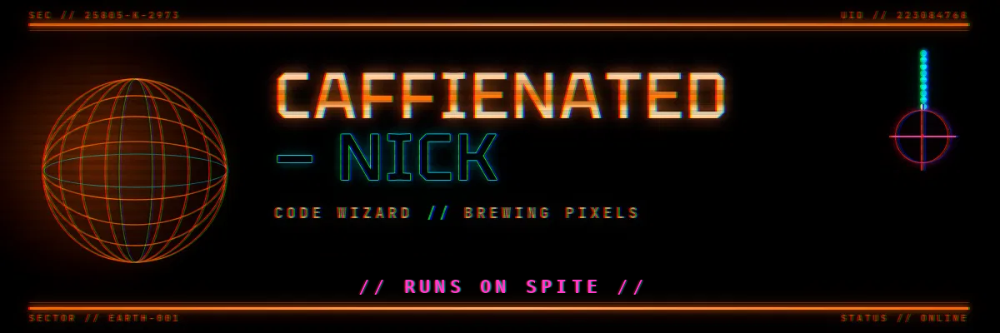

<div align="center">



<br/><br/>

[](https://git.io/typing-svg)

<br/>


</div>

<br/>

---

<h3 align="center">◢◤ DOSSIER ◥◣</h3>

<div align="center">

```ini
┌──────────────────────────────────────────┐
│  FIELD OPERATIVE FILE   //  K-D6-3.7      │
├──────────────────────────────────────────┤
│ DESIGNATION   : caffienated-nick          │
│ CLASS         : full-stack operative      │
│ POWER SOURCE  : espresso & late-night     │
│                 compile cycles            │
│ STATUS        : ONLINE                    │
│ SECTOR        : earth-001                 │
│ DIRECTIVE     : ship it, then make it     │
│                 elegant                   │
└──────────────────────────────────────────┘

AUTHORIZATION GRANTED TO THE ABOVE OPERATIVE
TO ACCESS, MODIFY, AND DEPLOY ANY REPOSITORY
FLAGGED UNDER THE LEGACY CODE CONTAINMENT ACT.
```

</div>

---

<h3 align="center">◢◤ ARSENAL ◥◣</h3>

<div align="center">


</div>

---

<h3 align="center">◢◤ CORE READINGS ◥◣</h3>

<div align="center">


<br/><br/>


<br/><br/>


</div>

---

<h3 align="center">◢◤ FIELD DEPLOYMENTS ◥◣</h3>

<div align="center">

[](https://github.com/caffienated-nick/muxless)
[](https://github.com/caffienated-nick/Hotel-management-system)

</div>

---

<h3 align="center">◢◤ INCOMING UPLINKS ◥◣</h3>

<div align="center">


</div>

<br/>

<div align="center">

```
◢◤◢◤◢◤◢◤◢◤◢◤◢◤◢◤◢◤  TRANSMISSION ENDS  ◢◤◢◤◢◤◢◤◢◤◢◤◢◤◢◤◢◤
░░░░░░░░░░░░░░░░░░░░░░░░  STATUS :: ONLINE  ░░░░░░░░░░░░░░░░░░░░░░░░
```

</div>
